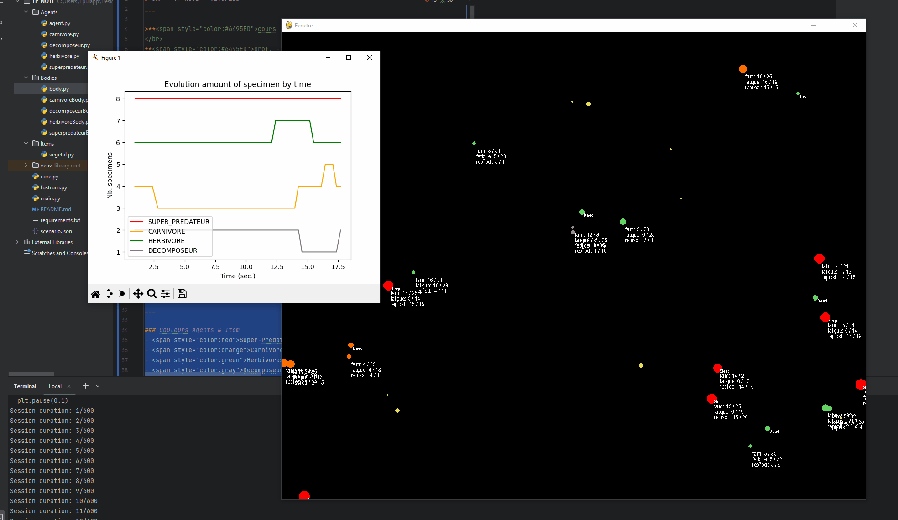

# SMA - TP NOTE > Vivarium
___
>**<span style="color:#6495ED">cours - SMA</span>**
</br>
**<span style="color:#6495ED">prof. - M. Baudoin Dafflon</span>**
</br>
**<span style="color:#6495ED">période - Janvier 2023</span>**



## Setup
___
Pour setup correctement le projet vous pourrez utiliser le fichier 
<span style="color:#6495ED">_"requirements.txt"_</span> mis à disposition avec toutes les dépendances nécéssaires.

```bash
python -m venv venv 
venv\Scripts\activate
pip install -r requirements.txt
```
Pour lancer le projet vous pouvez utiliser la commande ``py .\main.py`` dans un terminal.

## Raccourcis 
___
- Touche **"S"** : 
</br>``Affiche les stats globales actuelles de la simulation dans la console. (tot. pop; pourcentages par espèces; et le meilleur individus par espèces)``
</br>
</br>
- Touche **"Echap"** : 
</br>``Permet de quitter la simulation. (arrêt du programme et graphe dynamique)``

## Infos simulation
___

### Couleurs Agents & Item
- <span style="color:red">Super-Prédateurs</span>.
- <span style="color:orange">Carnivores</span>
- <span style="color:green">Herbivores</span>
- <span style="color:gray">Decomposeurs</span>
- <span style="color:yellow">Vegetals</span>

### Affichage stats 
Dans le fichier <span style="color:#6495ED">_"body.py"_</span> situé dans <span style="color:#6495ED">./Bodies/body.py</span> vous trouverez la **fonction show** (code ci-dessous), vous pourrez commenter/dé-commenter les afficchages souhaités.
```python
    def show(self):
        # Draw body
        core.Draw.circle(self.color, self.position, self.mass)

        # Draw if Agent is dead or sleeping
        if self.isDead is True:
            core.Draw.text((255, 255, 255), 'Dead', Vector2(self.position.x + 5, self.position.y), 10, 'Arial')
        elif self.isSleeping is True:
            core.Draw.text((255, 255, 255), 'Sleep', Vector2(self.position.x + 5, self.position.y), 10, 'Arial')

        # Draw agent stats
        if self.isDead is False:
            core.Draw.text((255, 255, 255), 'faim: ' + str(self.jaugeFaim) + ' / ' + str(self.faimMax),
                           Vector2(self.position.x + 5, self.position.y + 8), 13, 'Arial')
            core.Draw.text((255, 255, 255), 'fatigue: ' + str(self.jaugeFatigue) + ' / ' + str(self.fatigueMax),
                           Vector2(self.position.x + 5, self.position.y + 20), 13, 'Arial')
            core.Draw.text((255, 255, 255),
                           'reprod.: ' + str(self.jaugeReproduction) + ' / ' + str(self.reproductionMax),
                           Vector2(self.position.x + 5, self.position.y + 32), 13, 'Arial')

        # TESTING PURPOSE
        # # #
        # Draw perception radius
        # core.Draw.circle(self.color, self.position, self.fustrum.radius, 1)
        # Draw kill zone
        # core.Draw.circle((255, 255, 255), self.position, self.mass, 1)
```


